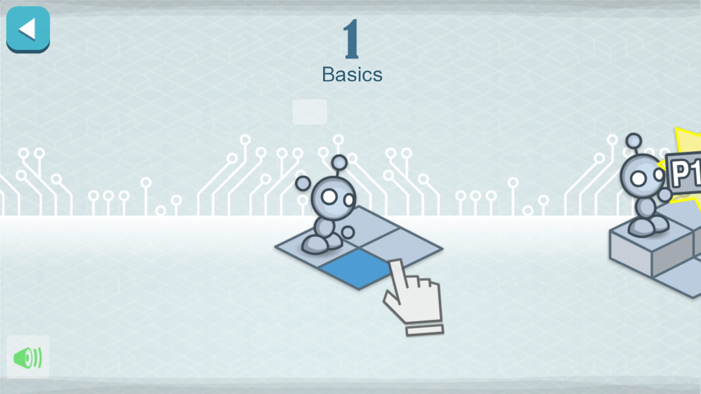
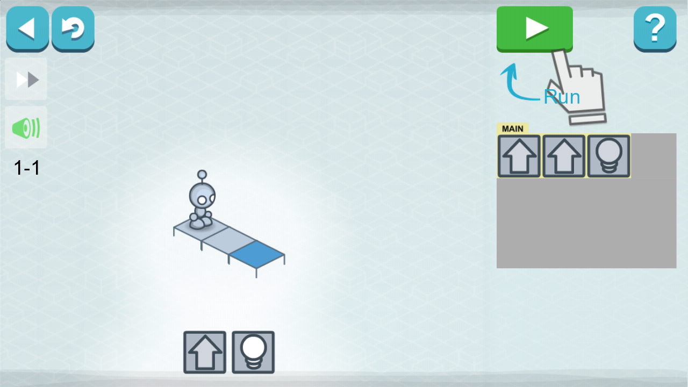
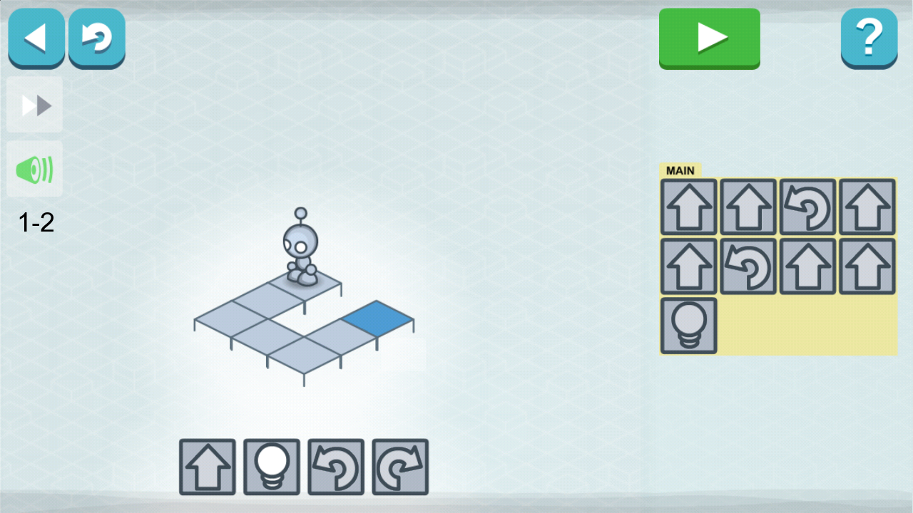
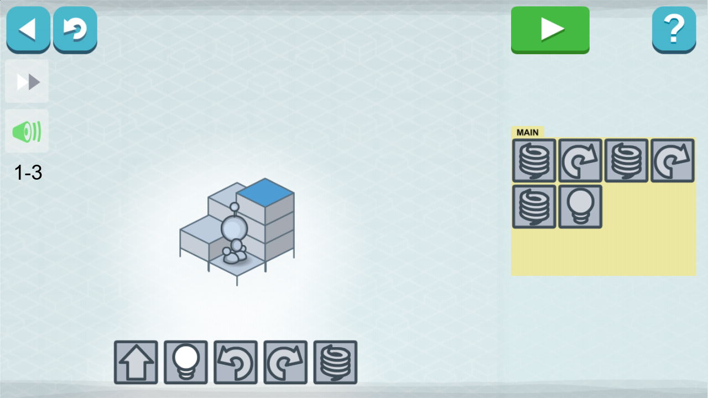
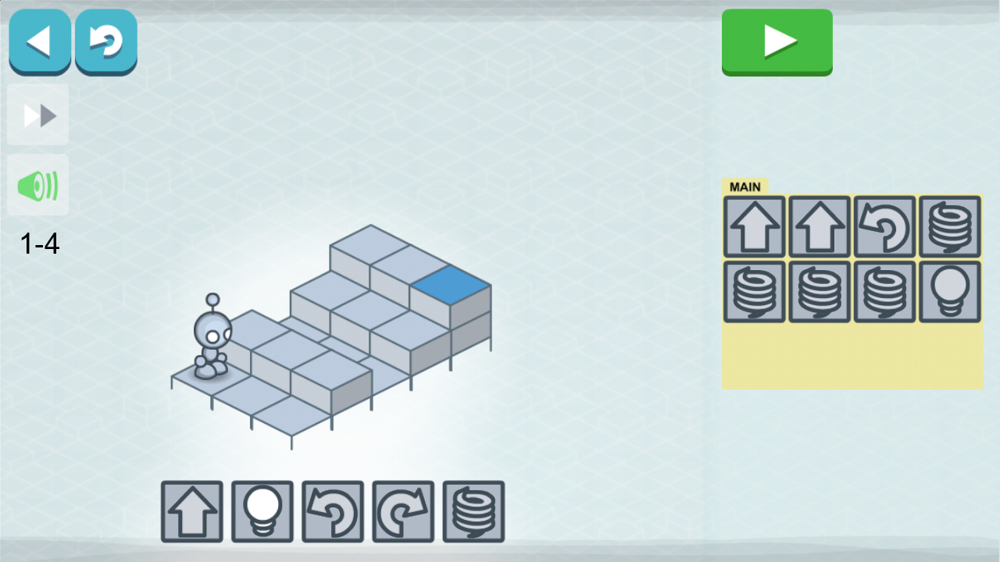

# 1 - Basics

<table border=0 align="center">
    <tr align="center" valign="middle">
        <td colspan="2">  </td>
    </tr>
    <tr align="center" valign="middle">
        <td><h3>Basics - 1</h3></td>
        <td><h3>Basics - 2</h3></td>
    </tr>
    <tr align="center" valign="middle">
        <td></td>
        <td></td>
    </tr>
    <tr align="center" valign="middle">
        <td><h3>Basics - 3</h3></td>
        <td><h3>Basics - 4</h3></td>
    </tr>
    <tr align="center" valign="middle">
        <td></td>
        <td></td>
    </tr>
</table>
