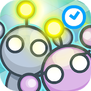

# Lightbot : Code Hour

Download game from [Google Play Store](https://play.google.com/store/apps/details?id=com.lightbot.lightbothoc "Google Play")

<tt>Description on play store:</tt>
  
Get kids programming in the most fun way: by solving puzzles in a videogame!

Lightbot - Code Hour is meant to introduce kids who have no experience whatsoever programming, and is all-ages friendly! That means anyone anywhere from K to 12 can play, have fun and learn real programming logic!

Lightbot is a programming puzzle game; it uses game mechanics that are firmly rooted in programming concepts. Lightbot lets players gain a practical understanding of basic concepts like instruction sequencing, procedures and loops, just by guiding a robot to light up tiles and solve levels.

Teachers worldwide are choosing Lightbot first when introducing their students to programming.

Lightbot - Code Hour features 20 levels. The full version of Lightbot features 50 levels for when you want more of a challenge!

This version of Lightbot has been translated to 28 different languages! Just hit a flag icon corresponding to the language in the game!
